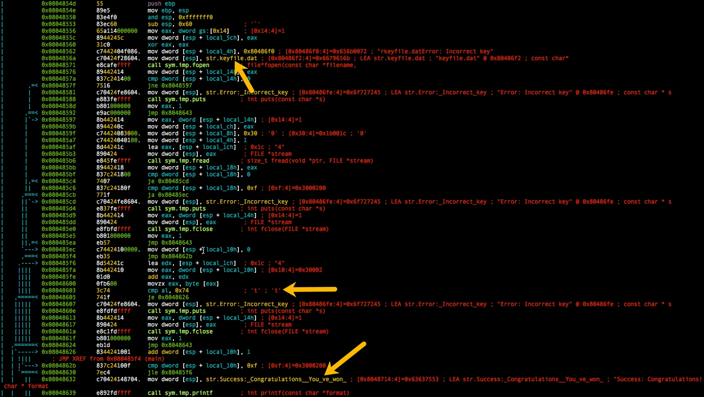
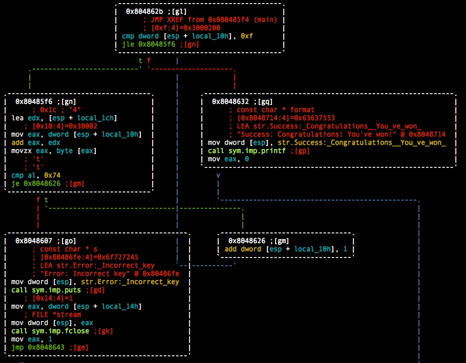
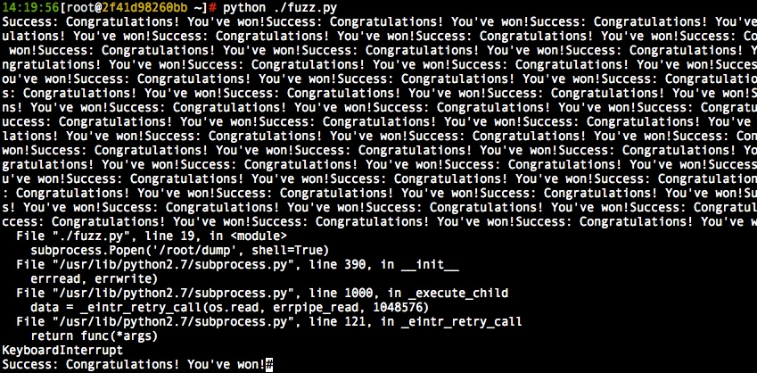
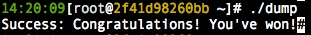

# [KEYGENME - EASY] Cracking Your First Program

<https://0x00sec.org/t/keygenme-easy-cracking-your-first-program/1075>

on that page it tells you what you have to do to obtain the binary, its basically decoding the `base64` string passing that to `gunzip` and then chaning ing the permissions of the file to executable.

## radare2 analysis 

opening the binary in radare2 and printing the disassembly of the main function shows some intresting items.

``` bash
# r2 -AAA ./dump

[0x08048450]> pdf @main
```



it could be hard to see in the picture but the binary looks for a `keyfile.dat`, and further in the disassembly shows a compare to 0x74 (t) `cmp al, 0x74`. 

## Cracking the binary

my first thoughts is to do the following 

``` bash
# echo t >keyfile.dat
# ./dump
```

however that did not work 

``` bash
# ./dump
Error: Incorrect key
```

back to r2 and in visual mode it looks like some for loop that could be incrementing the neded value 



so because i'm still learning this i'll fuzz the amount needed with the following script 

``` Python
#!/usr/bin/env python

import subprocess

while True:
    f = open('keyfile.dat', 'a')
    f.write('t')
    f.close()
    subprocess.Popen('/root/dump', shell=True)
```
running the script shows that its worked 



just one more thing to check 

``` bash
# ./dump
Success: Congratulations! You've won!
```

